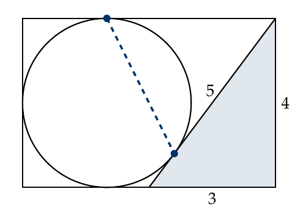

<!-- MathJax renders the LaTeX below (safe to keep even if your theme already loads it) -->

<!-- ================= EDIT EACH WEEK =================
  1. Replace the problem number, title, due date, and problem text below.
  2. Put the new PDF in files/pdfs/ and update the PDF link.
  3. Post last week's problem and model solution in the Canvas course.
  Keep everything inside HTML tags so Jekyll doesn't alter the LaTeX.
==================================================== -->

<h2>Problem #3: Two Points of Contact</h2>

<strong>Fall 2026 &middot; Due Monday, October 12 at 11:59 pm (Arizona time)</strong>

  
A circle and a right triangle with sides \(3\), \(4\), \(5\) sit inside a rectangle.
  The circle touches the top, bottom, and left sides of the rectangle. The triangle sits in the
  lower-right corner: its leg of length \(3\) lies along the bottom side, its leg of length \(4\)
  runs the full height of the right side, and its hypotenuse is tangent to the circle.

  
Find the length of the segment joining the point where the circle touches the top side to the
  point where the circle touches the hypotenuse (the dashed segment in the figure).

  

<a href="files/pdfs/2026-10-12.pdf">Printable PDF of Problem #3 (same content as this page)</a>

<h2>How to enter</h2>

The contest is open to all undergraduates at Northern Arizona University. You don't need to be a math major,
and you don't need to solve every problem to be on the ladder.

<ol>
  <li>Join the <a href="https://ac.nau.edu/lms-apps/self-enroll/545026">Problem of the Week Canvas course</a> (one time only; sign in with your NAU account).</li>
  <li>Write up your solution as a <strong>single PDF</strong>, either typed or neatly handwritten and scanned, with your name at the top. If you don't have a scanner, use a phone app like Microsoft Lens or Adobe Scan, or scan at the library.</li>
  <li>Upload it to that week's assignment in Canvas by <strong>Monday at 11:59 pm Arizona time</strong>. Late submissions are not accepted. If you submit more than once, only your last submission before the deadline is graded.</li>
</ol>

If your instructor gives credit for Problem of the Week, add their name and course as a submission comment in Canvas (e.g., <em>Swift, MAT 239</em>).

<h2>Rules</h2>
<ol>
  <li><strong>Your own work only.</strong> You may not discuss the problem with anyone (classmates, friends, tutors, or instructors) until after the deadline.</li>
  <li><strong>No AI, no internet, no calculators.</strong> This means no ChatGPT, Gemini, Claude, Copilot, Photomath, Wolfram Alpha, or similar tools; no web searches or online forums; and no calculators, computer algebra systems, or code. You <em>may</em> use your own textbooks and class notes to look up standard definitions and theorems.</li>
  <li><strong>Explain your reasoning.</strong> The goal is a clear, convincing mathematical argument, not an answer with a box around it. A correct answer without justification earns at most 1 point.</li>
  <li><strong>Be ready to explain it.</strong> The coordinator may ask any participant to talk through their solution in a short conversation (in person or on Teams). A submission you can't explain will receive a score of 0.</li>
  <li><strong>Don't share solutions</strong> or post them online before the deadline.</li>
  <li>Breaking these rules removes you from the ladder for the semester, and your instructor will not receive credit for your participation.</li>
</ol>

<em>By submitting, you certify that your solution is entirely your own work and follows these rules.</em>

<h2>Scoring and the ladder</h2>

Each solution is scored from 0 to 4:

<ul>
  <li><strong>4</strong> &ndash; complete, correct, and clearly explained</li>
  <li><strong>3</strong> &ndash; correct approach with a minor gap or error</li>
  <li><strong>2</strong> &ndash; substantial progress toward a solution</li>
  <li><strong>1</strong> &ndash; some relevant progress, or a correct answer without justification</li>
  <li><strong>0</strong> &ndash; no meaningful progress, or a rule violation</li>
</ul>

A ladder of total points is posted in the lobby of the Adel Math Building (across from the MAP room).
Names appear on the posted ladder but are never published on this website. If you'd prefer a nickname on the ladder,
or to be left off, send a Canvas message. A model solution is posted in Canvas after each deadline.

<h2>Questions</h2>

Send questions through Canvas Inbox or email <a href="mailto:ian.williams@nau.edu?subject=POTW">ian.williams@nau.edu</a> with "POTW" in the subject line.
Questions asking to clarify what a problem means are welcome; hints are not given.

<h2>Past problems</h2>

Previous problems and their model solutions are posted in the
<a href="https://ac.nau.edu/lms-apps/self-enroll/545026">Problem of the Week Canvas course</a>.
Only the current problem appears on this page.

